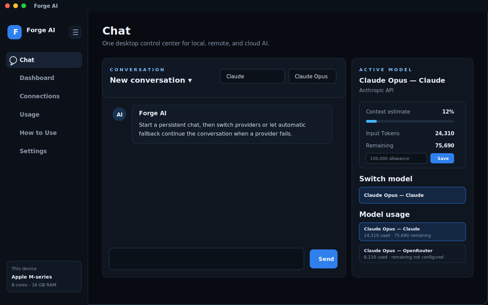
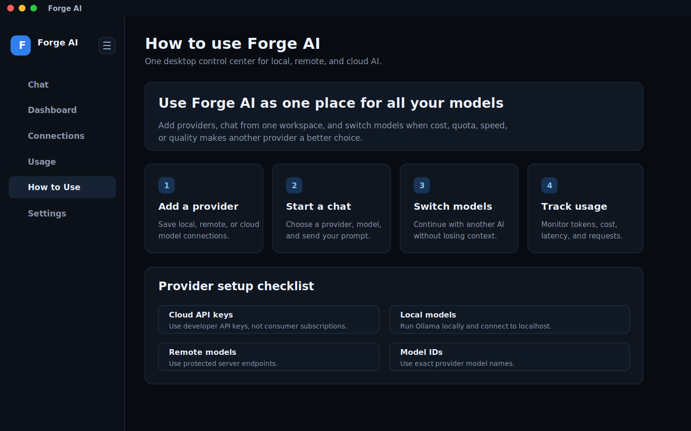
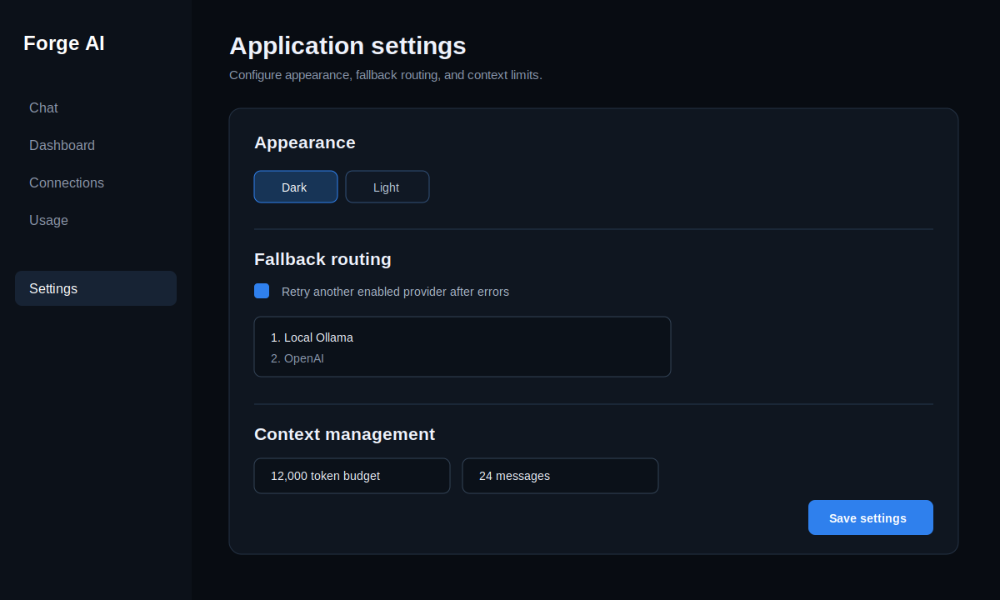
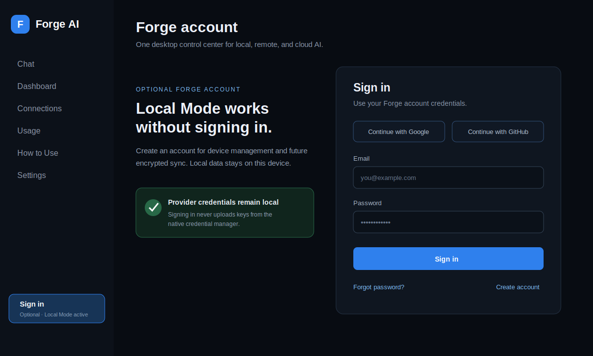

# Forge AI — Product Showcase

> A visual, self-contained walkthrough of Forge AI. This document is designed for product demonstrations, portfolio reviews, stakeholder discussions, and anyone who wants to understand the application without installing or running it.

## At a glance

Forge AI is a cross-platform desktop control center for local, remote, and cloud AI models. It brings provider setup, persistent conversations, automatic fallback, model-specific usage tracking, hardware telemetry, and optional account management into one native macOS and Windows application.

| Capability | What it provides |
| --- | --- |
| One chat workspace | Continue a conversation while manually switching between configured providers and models. |
| Multiple AI sources | Connect local Ollama, remote Ollama/Linux servers, OpenAI, Anthropic, Google Gemini, and OpenAI-compatible APIs. |
| Provider-aware model identity | Treat the same model served by different providers as separate entries, such as `Claude Opus - Claude` and `Claude Opus - Gemini`. |
| Automatic fallback | Retry another enabled connection after provider, quota, or network errors. |
| Usage visibility | Track requests, input/output tokens, estimated cost, latency, and context remaining. |
| Local-first storage | Keep conversations, settings, and usage on the device; store API keys in the operating system credential manager. |
| Optional identity | Use the app fully in Local Mode or sign in for device management and future encrypted synchronization. |
| Native desktop delivery | Produce macOS `.app`/`.dmg` and Windows `.exe`/`.msi` installers through Tauri. |

## The product in one view

The Chat screen is the center of Forge AI. The left navigation opens every product area, the middle column contains the persistent conversation, and the right panel explains which model is active and how much of its context and recorded usage has been consumed.

## Screen map

Forge AI opens on **Chat** by default. The navigation can collapse to preserve space while keeping every section accessible by icon.

| Screen | Purpose | Typical action |
| --- | --- | --- |
| **Chat** | Talk to an enabled provider/model while preserving local conversation history. | Select a provider, enter a model, send a prompt, or switch models mid-conversation. |
| **Dashboard** | Summarize device telemetry, connections, request volume, token usage, and execution targets. | Check whether the machine and configured providers are ready. |
| **Connections** | Add, edit, test, discover models for, enable/disable, and delete AI endpoints. | Configure a local Ollama server or a cloud API connection. |
| **Usage** | Review aggregate and per-provider/model requests, tokens, cost, latency, and history. | Compare two identically named models served through different providers. |
| **How to Use** | Provide an in-app onboarding and provider setup checklist. | Learn the four-step flow: connect, chat, switch, track. |
| **Settings** | Control appearance, automatic fallback order, and conversation context limits. | Select a theme and define routing/context behavior. |
| **Account** | Explain Local Mode and offer optional authentication/device management. | Continue without signing in or connect a Forge account. |

## 1. Chat

### What is visible

- A conversation selector for starting a new chat or reopening a locally saved conversation.
- Provider and model controls at the top of the workspace.
- A transcript that remains available after application restarts.
- Per-response token count, latency, and fallback-attempt metadata.
- A composer that sends with **Enter** and supports a newline with **Shift + Enter**.
- An active-model panel with context usage, remaining context, input/output tokens, estimated cost, and recent latency.
- A provider-qualified usage list in the format **Model - Provider**.
- One-click switching between enabled models.
- The current automatic fallback order.

### How conversations behave

Each conversation stores its provider, model, transcript, title, and last-updated time locally. When a user selects another provider, the existing transcript remains in the workspace, so the next model receives the bounded recent context rather than forcing the user to start again.

Forge AI applies both a token budget and a maximum-message limit. When the context grows too large, the newest messages that fit both limits are retained and the UI warns when the budget is nearly full.

### Provider-aware model tracking

Model identity includes both the configured connection and model ID. This prevents unrelated usage from being combined. For example:

| Displayed model | Tracked independently because |
| --- | --- |
| `Claude Opus - Claude` | Requests are sent through the Anthropic connection. |
| `Claude Opus - Gemini` | Requests are sent through a separate Gemini/provider connection. |
| `qwen2.5:7b - Local Ollama` | Work runs on the user's computer. |
| `qwen2.5:7b - Remote GPU` | Work runs on a remote Linux endpoint. |

The active conversation's remaining context is calculated by Forge AI. An account-wide provider quota is shown only if an API exposes an authoritative remaining allowance; otherwise the honest state is **Remaining unavailable**.

## 2. Dashboard

The Dashboard is the application's operational overview. It displays:

- configured connection count;
- total recorded requests;
- total recorded tokens;
- current CPU usage;
- detected CPU, core count, RAM, architecture, platform, and GPU information;
- every configured execution target with its provider type, default model, and enabled state.

This screen answers the quick pre-flight questions: *Is my machine detected? Which targets are configured? Are they enabled? Has the app processed requests?*

## 3. Connections

Connections are reusable provider profiles. A user can create profiles for:

| Type | Example use |
| --- | --- |
| Local Ollama | Run `qwen2.5:7b` on the same machine at `http://localhost:11434`. |
| Remote Ollama / Linux server | Use a private GPU server or another protected machine. |
| OpenAI API | Call models enabled for an OpenAI Platform project. |
| Anthropic API | Call Claude models enabled for an Anthropic Console account. |
| Google Gemini API | Call Gemini models available to a Google AI project. |
| OpenAI-compatible API | Connect any service implementing a compatible chat-completions API. |

### Connection form

Each profile contains a friendly name, provider type, base URL, API key where required, default model, enabled state, and optional input/output prices per million tokens.

From the form, the user can:

1. **Discover** model IDs supported by the endpoint.
2. **Test** the connection before relying on it.
3. **Save** the validated profile.
4. Later **Edit**, enable/disable, or **Delete** it.

API keys are not written into the normal connection JSON. They are stored through macOS Keychain or Windows Credential Manager. Existing keys are represented as stored and only need to be entered again when replacing them.

> ChatGPT Plus, Claude Pro, and Gemini Advanced are consumer subscriptions, not API credentials. Cloud connections require developer API access from the relevant provider.

## 4. Usage

Usage reporting separates both the provider connection and model instead of grouping by model name alone.

The screen includes:

- total requests;
- total input tokens;
- total output tokens;
- total estimated cost;
- per-model/provider cards;
- per-connection aggregates;
- a recent-request table with timestamp, provider, model, tokens, latency, and cost;
- a confirmation-protected action to clear local history.

Costs are estimates calculated from the optional input/output prices configured on the connection. Local models can use zero pricing, while cloud connections can be updated when provider pricing changes.

## 5. How to Use

The built-in guide makes the basic workflow visible inside the product:

1. Add a local, remote, or cloud provider.
2. Start a chat with a selected provider and model.
3. Switch models without losing the conversation context.
4. Track tokens, cost, latency, and requests.

It also reminds users that cloud APIs need developer keys, local Ollama must be running, remote endpoints should be protected, and exact provider model IDs should be used.

## 6. Settings

Settings are deliberately limited to behavior that affects the whole application.

### Appearance

Choose **Dark**, **Light**, or **System**. The preference persists and System follows the operating system color scheme.

### Fallback routing

Automatic fallback can be enabled or disabled. When enabled, Forge AI tries preferred enabled connections in the selected order after a provider, network, or quota failure, then considers other enabled connections.

### Context management

Two safeguards bound the transcript sent to a model:

- **Estimated token budget** limits approximate prompt size.
- **Maximum messages** limits the number of recent transcript entries.

Together they keep persistent conversations manageable across providers with different context windows.

## 7. Account and Local Mode

An account is optional. Without an account—or when the account service is not configured—Forge AI remains usable in **Local Mode** for chatting, connections, settings, and usage.

Signing in is intended for identity, connected-device management, session control, and future encrypted synchronization. It does not upload provider API keys, local conversations, settings, or usage history.

The account experience supports the service contract for:

- email registration and verification;
- sign-in and password reset;
- Google/GitHub device authorization;
- rotating desktop sessions;
- current/all-device logout;
- remote device revocation;
- account deletion.

## End-to-end user journey

### Local/private workflow

1. Install Ollama and pull a suitable model.
2. Open **Connections**, add Local Ollama, and discover/select the model.
3. Open **Chat**, select the connection, and start a persistent conversation.
4. Review context remaining beside the conversation.
5. Open **Dashboard** for device telemetry and **Usage** for request history.

### Hybrid local + cloud workflow

1. Add a local Ollama profile and one or more cloud API profiles.
2. Configure input/output pricing for cost estimates.
3. Enable automatic fallback and order the preferred connections.
4. Start work with the preferred model.
5. Switch manually for quality or speed, or let Forge AI retry after an error.
6. Compare each **Model - Provider** entry on the Usage screen.

### Remote-server workflow

1. Run Ollama on a protected Linux/GPU server.
2. Expose it through a VPN, private network, authenticated reverse proxy, or firewall-restricted endpoint.
3. Add the server as a Remote Ollama connection.
4. Test it, discover models, and use it from Chat like any other provider.

## What stays on the device

| Data | Current boundary |
| --- | --- |
| Conversations | Stored locally. |
| Provider configuration | Stored locally. |
| Provider API keys | Stored in macOS Keychain or Windows Credential Manager. |
| Settings | Stored locally. |
| Usage history | Stored locally and clearable by the user. |
| Optional account session | Stored securely for authentication/device management. |
| Provider request content | Sent only to the provider selected for that request, subject to fallback configuration. |

## How automatic fallback works

1. Forge AI sends the request to the selected enabled connection.
2. If the provider succeeds, the response and usage metadata are recorded.
3. If it fails and fallback is enabled, Forge AI tries configured enabled connections in order.
4. The successful provider/model becomes visible in response metadata and usage.
5. If every eligible provider fails, the conversation displays an error without discarding the user's transcript.

Fallback availability does not make different models identical; output quality and context limits can change when routing moves to another model.

## Suggested five-minute showcase script

1. Start on **Chat** and point out the three-part layout: navigation, transcript, active-model telemetry.
2. Show `Claude Opus - Claude` and `Claude Opus - Gemini` to explain provider-qualified usage.
3. Explain persistent context and the remaining-context meter.
4. Move to **Connections** and describe local, remote, cloud, testing, and model discovery.
5. Move to **Dashboard** and explain execution targets plus device telemetry.
6. Move to **Usage** and explain tokens, latency, costs, and request history.
7. Open **Settings** to demonstrate theme, fallback order, and context budgets.
8. Finish on **Account** and emphasize that Local Mode is fully functional and secrets remain in the native credential manager.

## Current product boundary

Forge AI is ready for cross-platform testing. Before public distribution, the native installers still need real-device verification, live provider compatibility checks using tester-owned credentials, macOS notarization, Windows code signing, and production validation of any optional account service. The repository's [pre-deployment checklist](../TODO.md) is the source of truth for those release gates.

---

For implementation and developer setup, see the [README](../README.md). For component boundaries and request flow, see the [architecture guide](ARCHITECTURE.md). For privacy details, see [Account and local-data privacy](PRIVACY.md).
